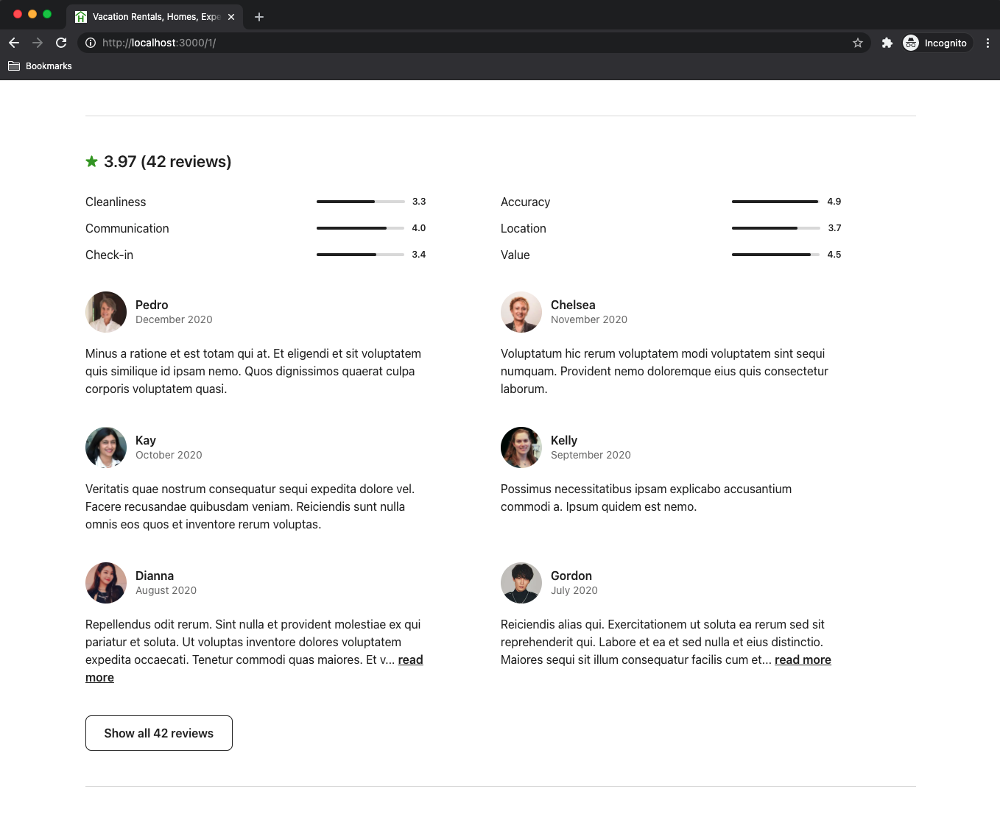
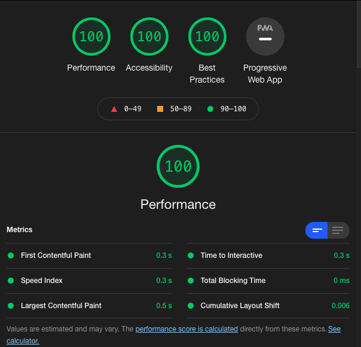

# A Web Application to Reserve Rental Property

Snapshots of component at different breakpoints:

  

    
  

  

    
  

  

    
  

  

    
  

  

    
  

  

    
  

Google LightHouse:

  

## Related Projects

  - https://github.com/The-Casuals/photo_gallery
  - https://github.com/The-Casuals/casual-checkout-service
  - https://github.com/The-Casuals/reviews
  - https://github.com/The-Casuals/photo_carousel

## Table of Contents

1. [Usage](#Usage)
2. [Requirements](#requirements)

## Usage

1. npm run seed: to seed the database
2. npm run watch: to build webpack and watch
3. npm start: to start the server

## Requirements

- Node v14.15.4
- MongoDB v4.4.3

### Installing Dependencies

1. npm i: to install dependencies
